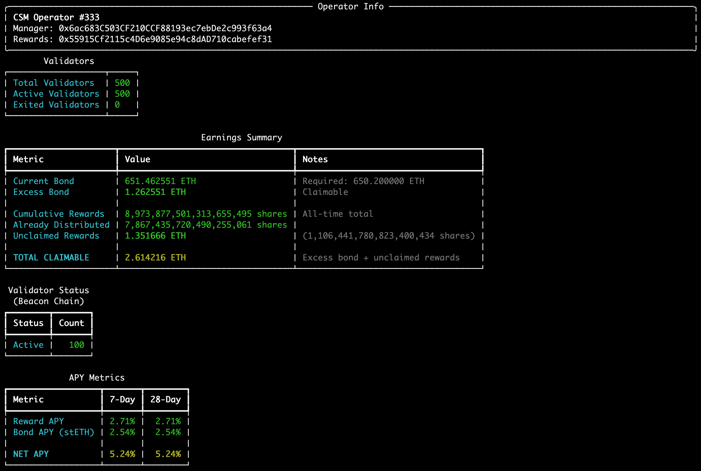
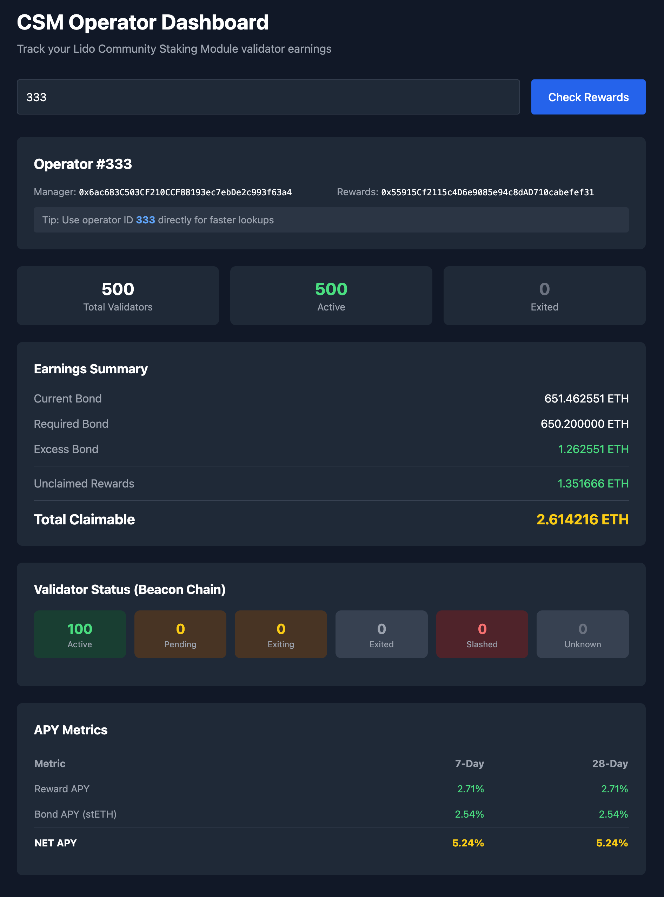

# Lido CSM Operator Dashboard

Track your Lido Community Staking Module (CSM) validator earnings, excess bond, and cumulative rewards.





## Features

- Look up operator by Ethereum address (manager or rewards address) or operator ID
- View current bond vs required bond (excess is claimable)
- Track cumulative rewards and unclaimed amounts
- Detailed validator status from beacon chain (with `--detailed` flag)
- APY metrics: reward APY, bond APY (stETH rebase), and net APY
- JSON output for scripting and automation
- CLI for quick terminal lookups
- Web interface for browser-based monitoring

## Installation

```bash
# Clone the repository
git clone <repo-url>
cd lido-csm-dashboard

# Install with pip
pip install -e .

# Or with uv
uv pip install -e .
```

## Configuration

Copy `.env.example` to `.env` and configure:

```bash
cp .env.example .env
```

Available settings:
- `ETH_RPC_URL`: Ethereum RPC endpoint (default: https://eth.llamarpc.com)
- `BEACON_API_URL`: Beacon chain API (default: https://beaconcha.in/api/v1)
- `BEACON_API_KEY`: Optional API key for beaconcha.in (higher rate limits)
- `CACHE_TTL_SECONDS`: Cache duration in seconds (default: 300)

## Usage

### `csm check` - Check operator rewards

```bash
csm check [ADDRESS] [OPTIONS]
```

| Argument/Option | Short | Description |
|-----------------|-------|-------------|
| `ADDRESS` | | Ethereum address (required unless `--id` is provided) |
| `--id` | `-i` | Operator ID (skips address lookup, faster) |
| `--detailed` | `-d` | Include validator status from beacon chain and APY metrics |
| `--json` | `-j` | Output as JSON (same format as API) |
| `--rpc` | `-r` | Custom RPC URL |

**Examples:**

```bash
# Check by address
csm check 0xYourAddress

# Check by operator ID (faster)
csm check --id 42

# Get detailed validator info and APY
csm check --id 42 --detailed

# JSON output for scripting
csm check --id 42 --json

# JSON with detailed info
csm check --id 42 --detailed --json
```

### `csm watch` - Continuous monitoring

```bash
csm watch ADDRESS [OPTIONS]
```

| Argument/Option | Short | Description |
|-----------------|-------|-------------|
| `ADDRESS` | | Ethereum address to monitor (required) |
| `--interval` | `-i` | Refresh interval in seconds (default: 300) |
| `--rpc` | `-r` | Custom RPC URL |

**Examples:**

```bash
# Monitor with default 5-minute refresh
csm watch 0xYourAddress

# Monitor with 60-second refresh
csm watch 0xYourAddress --interval 60
```

### `csm list` - List all operators

```bash
csm list [OPTIONS]
```

| Option | Short | Description |
|--------|-------|-------------|
| `--rpc` | `-r` | Custom RPC URL |

Lists all operator IDs that have rewards in the current merkle tree.

### `csm serve` - Start web dashboard

```bash
csm serve [OPTIONS]
```

| Option | Description |
|--------|-------------|
| `--host` | Host to bind to (default: 127.0.0.1) |
| `--port` | Port to bind to (default: 8080) |
| `--reload` | Enable auto-reload for development |

**Examples:**

```bash
# Start on default port
csm serve

# Start on custom port
csm serve --port 3000

# Development mode with auto-reload
csm serve --reload
```

Then open http://localhost:8080 in your browser.

## JSON Output

The `--json` flag outputs data in the same format as the API, making it easy to integrate with scripts or other tools:

```bash
csm check --id 333 --json
```

```json
{
  "operator_id": 333,
  "manager_address": "0x6ac683C503CF210CCF88193ec7ebDe2c993f63a4",
  "reward_address": "0x55915Cf2115c4D6e9085e94c8dAD710cabefef31",
  "rewards": {
    "current_bond_eth": 651.5523536856277,
    "required_bond_eth": 650.2,
    "excess_bond_eth": 1.3523536856277778,
    "cumulative_rewards_shares": 8973877501313655495,
    "cumulative_rewards_eth": 10.9642938931415,
    "distributed_shares": 7867435720490255061,
    "distributed_eth": 9.61244204773546,
    "unclaimed_shares": 1106441780823400434,
    "unclaimed_eth": 1.3518518454060409,
    "total_claimable_eth": 2.7042055310338187
  },
  "validators": {
    "total": 500,
    "active": 500,
    "exited": 0
  }
}
```

With `--detailed`, additional fields are included:

```json
{
  "operator_id": 333,
  "...": "...",
  "validators": {
    "total": 500,
    "active": 500,
    "exited": 0,
    "by_status": {
      "active": 100,
      "pending": 0,
      "exiting": 0,
      "exited": 0,
      "slashed": 0,
      "unknown": 0
    }
  },
  "performance": {
    "avg_effectiveness": 98.5
  },
  "apy": {
    "reward_apy_7d": 4.2,
    "reward_apy_28d": 4.2,
    "bond_apy": 3.1,
    "net_apy_7d": 7.3,
    "net_apy_28d": 7.3
  }
}
```

## API Endpoints

- `GET /api/operator/{address_or_id}` - Get operator rewards data
  - Query param: `?detailed=true` for validator status and APY
- `GET /api/operators` - List all operators with rewards
- `GET /api/health` - Health check

## Data Sources

- **On-chain contracts**: CSModule, CSAccounting, CSFeeDistributor, stETH
- **Rewards tree**: https://github.com/lidofinance/csm-rewards (updates hourly)
- **Beacon chain**: beaconcha.in API (for validator status)
- **Lido API**: stETH APR data (for bond APY calculations)

## Contract Addresses (Mainnet)

- CSModule: `0xdA7dE2ECdDfccC6c3AF10108Db212ACBBf9EA83F`
- CSAccounting: `0x4d72BFF1BeaC69925F8Bd12526a39BAAb069e5Da`
- CSFeeDistributor: `0xD99CC66fEC647E68294C6477B40fC7E0F6F618D0`
- stETH: `0xae7ab96520DE3A18E5e111B5EaAb095312D7fE84`

## Development

```bash
# Install dev dependencies
pip install -e ".[dev]"

# Run tests
pytest
```

## License

MIT
